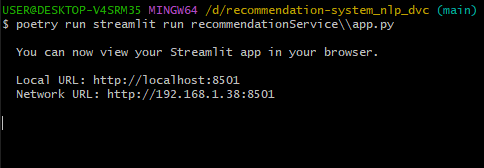

# Recommendation-system_nlp_dvc

Bigbasket product recommendation system using TfIdf Vectorization and cosine similarity of the product details.

[Dataset(Kaggle) Link](https://www.kaggle.com/datasets/surajjha101/bigbasket-entire-product-list-28k-datapoints)

---

## Recommendation

- Content-Based Filtering
- Tf-Idf Vectorizer
- Streamlit

---

s

## GUI reference

Streamlit gui


## Screenshots

Running the DVC Pipeline


Streamlit GUI


## Installation

Install my-project with poetry, git clone this repo then cd to the folder.

```bash
  poetry install
```

## Run the App

span into shell

```bash
  poetry shell
```

then run the program.

```bash
   poetry run dvc repro -f
```

then run the GUI.

```bash
   poetry run streamlit run recommendationService\\app.py
```

#### Authors

- [@Amaithi Chirasan](https://www.github.com/amaithi-sam)
